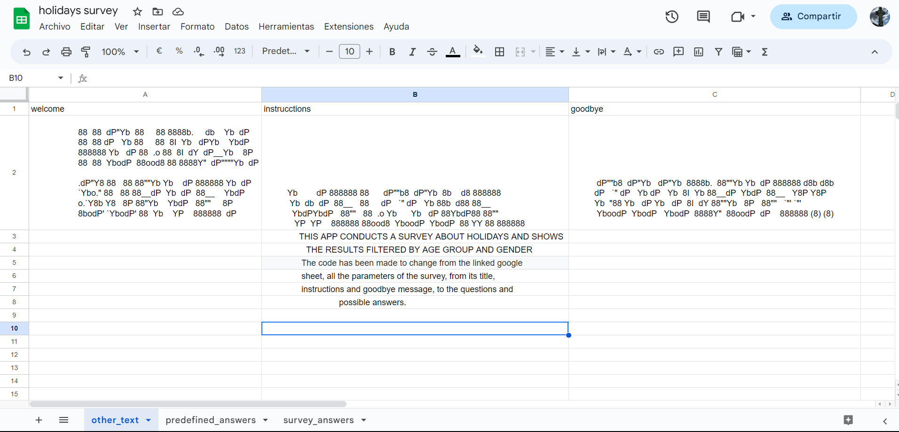

# Holidays Survey

This python project generates a survey (a holiday survey by default) and then displays the results by applying filters based on the age group and gender questions.
The most remarkable feature about the project is the ability to configure the entire survey from the linked google sheet, from the title, the introductory messages, the questions and answers, to the goodbye message.

All changes can be done just changing linked cells in the google sheet.

The project can be viewed here: https://holiday-survey-87184cd3dbf0.herokuapp.com/

## Table of Contents
1. [User Experience](#user-experience-ux)
    - [Project Goals](#project-goals)
    - [User Stories](#user-stories)
    - [Data Model](#data-model)
    - [Flowchart](#flowchart)
2. [Features](#features)
    - [Title Screen](#title-screen)
    - [Main Menu](#main-menu)
    - [Taking the Survey](#taking-the-survey)
    - [Retake Survey or Show Results](#retake-survey-or-show-results)
    - [View Results](#view-results)
    - [Exit Screen](#exit-screen)
3. [Technololgies Used](#technologies-used)
    - [Languages](#languages)
    - [Frameworks, Libraries and Programmes](#frameworks-libraries-and-programmes)
4. [Testing](#testing)
    - [Testing User Stories](#testing-user-stories)
    - [Code Validation](#code-validation)
    - [Feature Testing](#feature-testing)
    - [Bugs](#bugs)
6. [Deployment](#deployment)
6. [Credit](#credit)
    - [Content](#content)
    - [Media](#media)
    - [Code](#code)
7. [Acknowledgements](#acknowledgements)

## User experience (UX)

### Project Goals

- Collect user answer for survey.
- Store data in a Google sheet.
- Show survey result in a convenient format.
- show the questions and results in a tidy and clear way.
- Get a 100% reconfigurable format from the Google sheet file.
- Implement data validation for all inputs.

### User Stories

- As a user, I would like to understand the program purpose.
- As a user, I would like to be able to choose whether to take the survey, show results or exit the program.
- As a user, I would like to be able to review my answers before submitting.
- As a user, I would like to be able to discard my answers and get the survey again.
- As a user, I would like to be able to see the survey result filtered by age group or gender.
- As a user, I would like to be able to choose which age group or gender I want to see the results of.
- As a user, I would like to be able to see different filtered result before exit.

### Data Model

The program uses a Google sheet to store the information collected from the survey.

The google sheet also contains the questions as the column head, and the possible answers listed within each column.

The Title, welcome message and goodbye message are also stored in the Google sheet.

A pandas dataframe is used to display the results tables.

There is a user_choices variable that store the user answers in a list. There is a survey_questions variable that store questions as key and options list as values in a dictionary.

This is the Google sheet used to store the data.

This is the Google sheet used to store questions and options.

This is the Google sheet used to store the Title, welcome message and goodbye message.

### Flowchart

[Diagrams](https://app.diagrams.net/) was used to create the original flowchart for the project.
During the development process, more options and input validations were included that are not in the original flowchart.

## Features

### Title Screen

- This screen shows the name of the survey.

- This is the welcome screen and shows an introductory message.
- The user needs to press enter to continue to next screen.

- This screen shows more information about the program features.
- The user needs to press enter to continue to next screen.

### Main Menu

- This screen shows the survey main menu that gives the user three options:
    - Take the survey
    - View the results
    - Exit

### Taking the Survey

- This part of the program shows all the questions with the options below and the message "Enter your choice:" 

### Retake Survey or Show Results

- This screen thanks the user for taking the survey, then show the results and give three options:
    - Repeat the survey
    - Submit the answers and show the survey results
    - Submit the answers and exit

### View Results

- This section 

