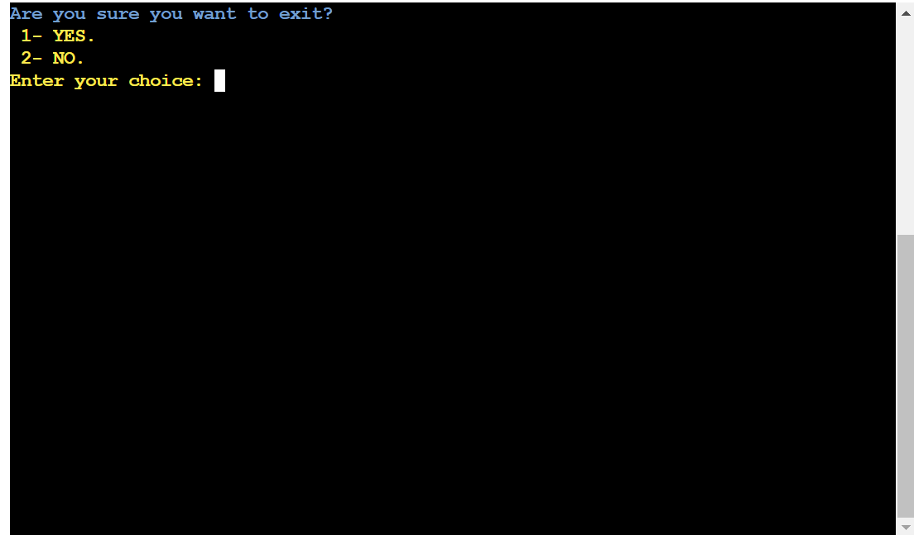

# Holidays Survey

This python project generates a survey (a holiday survey by default) and then displays the results by applying filters based on the age group and gender questions.
The most remarkable feature about the project is the ability to configure the entire survey from the linked google sheet, from the title, the introductory messages, the questions and answers, to the goodbye message.

All changes can be done just changing linked cells in the 
Google sheet.

The project can be viewed here: https://holiday-survey-87184cd3dbf0.herokuapp.com/

## Table of Contents
1. [User Experience](#user-experience-ux)
    - [Project Goals](#project-goals)
    - [User Stories](#user-stories)
    - [Data Model](#data-model)
    - [Flowchart](#flowchart)
2. [Features](#features)
    - [Title Screen](#title-screen)
    - [Main Menu](#main-menu)
    - [Taking the Survey](#taking-the-survey)
    - [Retake Survey or Show Results](#retake-survey-or-show-results)
    - [View Results](#view-results)
    - [Exit Screen](#exit-screen)
3. [Technologies Used](#technologies-used)
    - [Languages](#languages)
    - [Frameworks, Libraries and Programmes](#frameworks-libraries-and-programmes)
4. [Testing](#testing)
    - [Testing User Stories](#testing-user-stories)
    - [Code Validation](#code-validation)
    - [Feature Testing](#feature-testing)
    - [Bugs](#bugs)
5. [Deployment](#deployment)
6. [Credit](#credit)
    - [Content](#content)
    - [Media](#media)
    - [Code](#code)
7. [Acknowledgements](#acknowledgements)

## User experience (UX)

### Project Goals

- Collect user answer for survey.
- Store data in a Google sheet.
- Show survey result in a convenient format.
- Show the questions and results in a tidy and clear way.
- Get a 100% reconfigurable format from the Google sheet file.
- Implement data validation for all inputs.

### User Stories

- As a user, I would like to understand the program purpose.
- As a user, I would like to be able to choose whether to take the survey, show results or exit the program.
- As a user, I would like to be able to review my answers before submitting.
- As a user, I would like to be able to discard my answers and get the survey again.
- As a user, I would like to be able to see the survey result filtered by age group or gender.
- As a user, I would like to be able to choose which age group or gender I want to see the results of.
- As a user, I would like to be able to see different filtered result before exit.

### Data Model

The program uses a Google sheet to store the information collected from the survey.

The Google sheet also contains the questions as the column head, and the possible answers listed within each column.

The Title, welcome message and goodbye message are also stored in the Google sheet.

A pandas data frame is used to display the results tables.

There is a user_choices variable that store the user answers in a list. There is a survey_questions variable that store questions as key and options list as values in a dictionary.

This is the Google sheet used to store the data.

This is the Google sheet used to store questions and options.

This is the Google sheet used to store the title, welcome message and goodbye message.

### Flowchart

[Diagrams](https://app.diagrams.net/) was used to create the original flowchart for the project.
During the development process, more options and input validations were included that are not in the original flowchart.

## Features

### Title Screen

- This screen shows the name of the survey.

- This is the welcome screen and shows an introductory message.
- The user needs to press enter to continue to next screen.

- This screen shows more information about the program features.
- The user needs to press enter to continue to next screen.

### Main Menu

- This screen shows the survey main menu that gives the user three options:
    - Take the survey
    - View the results
    - Exit

### Taking the Survey

- This part of the program shows all the questions with the options below and the message "Enter your choice:" 

### Retake Survey or Show Results

- This screen thanks the user for taking the survey, then show the results and give three options:
    - Repeat the survey
    - Submit the answers and show the survey results
    - Submit the answers and exit

- In case the user choose options 2 or 3 the programs shows the update survey screen. It also allows the user to apply the first filter selection.

### View Results

- This section gives the user the option to filter the results by age group or gender. The user can also come back to the main menu from this screen. 

- This screen shows the second filter selection in order to select which age group or gender the user choose to apply the second filter.
    - For age group.
    
    - For gender.
    

- After the filter selection, the user can select a question from the survey to display the results.

- Once the user select the last filter, the program shows a table with the survey results applying the chosen filters.

- Each time a table is displayed, the user must press a key that will return him/her to the first filter selection screen.

### Exit Screen

- If the user chooses to exit from any menu on the program, the exit confirmation screen will appear.

- When the user chooses NO, he/she will return to main menu.

- When the user chooses YES, the goodbye message will appear.

## Technologies Used

### Languages

- Python

### Frameworks, Libraries and Programmes
- [Diagrams](https://app.diagrams.net): this was used to create a flowchart in the planning stage of the project.
- [Colorama](https://pypi.org/project/colorama/): this was used to add colour to the terminal to improve UX and readability.
- [Tabulate](https://pypi.org/project/tabulate/): this was used to display data in tables. 
- [Pandas](https://pypi.org/project/pandas/): this was used to store and analyse survey data using data frames.
- [NumPy](https://pypi.org/project/numpy/): this was used to analyse survey data.
- [Gspread](https://docs.gspread.org/en/v5.7.0/): this is the API for Google sheets, which stores the survey data. 
- [Codeanywhere](https://app.codeanywhere.com): this was used to write, commit and push the code to GitHub. 
- [GitHub](https://github.com/): this was used to store the project and for version control.
- [Heroku](https://dashboard.heroku.com/login): this was used to host and deploy the finished project.

## Testing

### Testing User Stories

- As a user, I would like to understand the program purpose.
    - The program always shows readable instructions and maintains a smooth path through menus and questions.
- As a user, I would like to be able to choose whether to take the survey, show results or exit the program.
    - The menus are designed to give these options to the user.
- As a user, I would like to be able to review my answers before submitting.
    - The update survey screen gives the user all his/her answers displayed.
- As a user, I would like to be able to discard my answers and get the survey again.
    - The update survey screen also gives the user this option.
- As a user, I would like to be able to see the survey result filtered by age group or gender.
    - The survey results can be filtered by age group or gender.
- As a user, I would like to be able to choose which age group or gender I want to see the results of.
    - The results can be filtered by male or female and by age group.
- As a user, I would like to be able to see different filtered result before exit.
    - The program allows the user to do as many result tables as he/she wishes before exit.

## Code Validation

- This program was validated using the PEP8 tool provided by Code Institute with no errors.

- There is a persistent problem when using codeanywhere code validation. This problem was not shown in Code Institute validation.
The variable is used inside the function to append the user_input.

## Feature Testing

- I have manually tested the following features in Gitpod and in the Code Institute Heroku terminal:

TEST       | DESIRED RESULT          | PASS/FAIL |
---------- | ----------------------- | --------- |
Title screen | When the program runs, the Title screen is displayed and stay for 5 seconds | PASS
Welcome message | When Title screen closes, the welcome message is displayed and the user must press Enter to continue | PASS
Second presentation screen | When the user press Enter, the second presentation screen is displayed and the user must press Enter again to continue. | PASS
Main Menu | When the user press Enter the Main Menu is displayed with 3 options, 1- take survey, 2 - View Survey Results and 3- Exit. Typing the chosen option takes you to the right screen. | PASS
Age group question | When typing option 1 in Main menu the survey starts and show the age group question with 6 options, all of them shows a message with the selected option after typing it and takes you to the next question. | PASS
Gender question | There are 2 options, the 2 of them shows a message with the selected option after typing it and takes you to the next question. | PASS
Mate question | This question shows 4 options, all of them shows a message with the selected option after typing it and takes you to the next question. | PASS
Season question | This question shows 4 options, all of them shows a message with the selected option after typing it and takes you to the next question. | PASS
Continent question | this question shows 6 options, all of them shows a message with the selected option after typing it and takes you to the next question. | PASS
Country question | this question shows 10 options, all of them shows a message with the selected option after typing it and takes you to the next question. | PASS
Places question | this question shows 9 options, all of them shows a message with the selected option after typing it and takes you to the next question. | PASS
The most question | this question shows 8 options, all of them shows a message with the selected option after typing it and takes you to the next question. | PASS
The least question | this question shows 9 options, all of them shows a message with the selected option after typing it and takes you to the next question. | PASS
Recommend question | this question shows 2 options, all of them shows a message with the selected option after typing it and takes you to the next question. | PASS
Survey results screen | This screen shows a thanks message and a list with all the user's answers. Then displays a menu with 3 options, 1- Repeat the survey, 2- submit and view results and 3-submit and exit, all options works as expected. | PASS
Update survey result screen | This screen displays an updating message and a second message when the survey has been updated. Then shows the survey results menu to choose between filter by age group or gender or exit, all options works as expected. In case the user choose to exit after submit in the previous screen, the program will show the exit menu with 2 options, both working as expected | PASS
Age group selection | This screen show a message on top to shows that the user is in the survey results section and then show the 6 options to filter by age group, all of them working as expected | PASS
Gender selection | This screen show a message on top to shows that the user is in the survey results section and then show the 2 options to filter by gender, all of them working as expected | PASS
Question selection | This screen show a message on top to shows that the user is in the survey results section and then show the 8 options to filter by question, all of them working as expected | PASS
Results table | When the user chooses between the questions, the program displays a result table with the filters requested showing all the options chosen by the surveyed people, the number of times that option was choosen and the percentage of the total that number represents. To continue to the next screen, the user must press Enter | PASS
Exit menu | When the user chooses to exit, the program displays a 2 options menu, both of them working as expected | PASS
Goodbye message | When the user chooses YES in the exit menu, the program displays a goodbye message and then exit. | PASS

## Bugs

1. Lack of exit option in main menu:
    - I noticed that there was no exit option in the main menu, so when returning to it, it was not possible to exit the program without taking the survey again. An exit choice was added to the main menu.
2. Questions for filters in wrong order:
    - When I decided to implement a second filter to show only a specific age group or a specific gender, the program asks first to filter by age group or gender, secondly filter by question and then choose which age group or which gender. I had to restructure the function question_selection to solve the problem.
3. Colour text bugs:
    - For some text, I had to fix the colours and add brightness to some of them for a better display.

## Deployment

The program was developed in Codeanywhere. It was then committed and pushed to GitHub.
The finished project was deployed in Heroku using the Code Institute Python Terminal for display purposes. 
Deployment to Heroku was completed using the following steps: 
1. Run 'pip3 freeze > requirements.txt' in the terminal to add a list of dependencies to requirements.txt
2. Commit these changes and push to GitHub.
3. Open and login to [Heroku](https://id.heroku.com/login).
4. From the dashboard, click 'New', then click 'Create new app'.
5. Enter the App name, choose a region, then click 'Create app'.
6. Navigate to the 'Settings' tab.
7. Within 'Settings', navigate to 'Config Vars'.
8. Two config vars need to be added using the following 'KEY' and 'VALUE' pairs:
    1. KEY = 'CREDS', VALUE = Copy and paste the entire contents of the creds.json file into this field. Then click 'Add'.
    2. KEY = 'PORT', VALUE = '8000'. Then click 'Add'.
9. Within 'Settings', navigate to 'Buildpack'. 
10. Click 'Add buildpack'. Select 'Python', then click 'Save changes'.
11. Click 'Add buildpack' again. Select 'nodejs', then click 'Save changes'.
    - Ensure that these buildpacks are in the correct order: Python on top and nodejs underneath. 
    - If they are in the wrong order, click and drag to fix this. 
12. Navigate to the 'Deploy' tab. 
13. Within 'Deploy', navigate to 'Deployment method'. 
14. Click on 'GitHub'. Navigate to 'Connect to GitHub' and click 'Connect to GitHub' 
15. Within 'Connect to GitHub', use the search function to find the repository to be deployed. Click 'Connect'.
16. Navigate to either 'Automatic Deploys' or 'Manual Deploys' to choose which method to deploy the application.
17. Click on 'Enable Automatic Deploys' or 'Deploy Branch' respectively, depending on chosen method. 
18. Once the app is finished building, a message saying 'Your app was successfully deployed' will appear.
19. Click 'View' to see the deployed app. 

## Credits

### Content

- All content was originally created and written by Miguel Angel Sanchez Leon, the developer.

### Media

- [Patorjk ASCII Art Generator](http://patorjk.com/software/taag/#p=display&f=Graffiti&t=Type%20Something%20) This web was used to generate the Title, welcome and goodbye messages.

### Code

- [GeekforGeeks](https://www.geeksforgeeks.org/clear-screen-python/) was used to implement a clear screen code.
- [Data analysis with Python](https://apps.cognitiveclass.ai/learning/course/course-v1:CognitiveClass+DA0101EN+v2/home) I took this course during the developing process to have a better understanding of how to use pandas and data frames.

## Acknowledgements

- Many thanks to my mentor Marcel, that has been a light at the end of the tunnel and a great adviser during the development process.
- Thanks to the slack community that is always ready to help.
- Thanks to Code Institute for instructing me and teaching me everything necessary for this project.